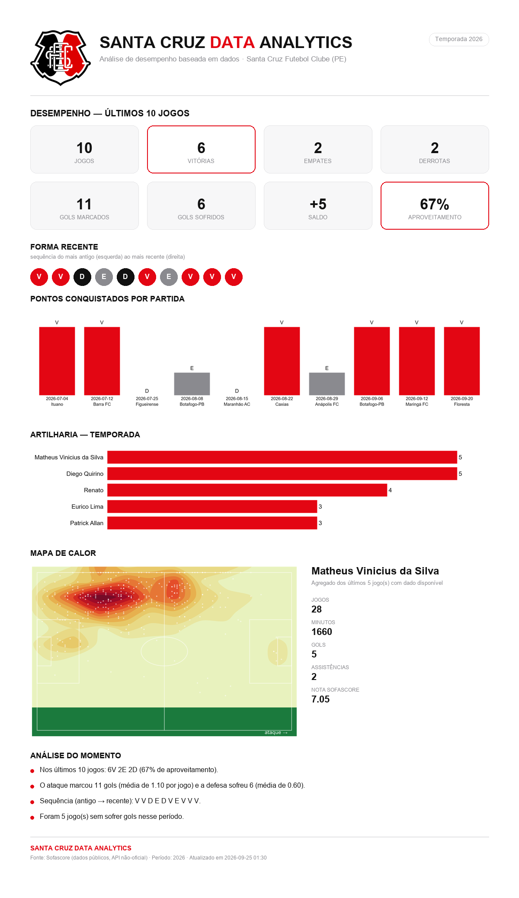

# ⚽ Santa Cruz Data Analytics

Plataforma local e **100% gratuita** de análise de desempenho do **Santa Cruz Futebol
Clube (PE)** — dados, futebol, scouting e performance. Coleta automaticamente os jogos
do time no **Sofascore**, guarda tudo em um banco **SQLite** e apresenta a análise em
um dashboard **Streamlit** multipágina, com identidade visual própria (as 3 cores do
escudo: preto, branco e vermelho).

<p align="center">
  
</p>

```bash
pip install -r requirements.txt
python -m src.collectors.run      # 1ª vez: popular o banco
streamlit run app.py             # abrir a plataforma
```

---

## 1. Objetivo

Transformar dados públicos de partidas em uma visão clara de:

- desempenho do time (resultados, gols, forma, mando de campo, evolução, por
  competição e por período);
- desempenho individual e **scouting** (perfil do jogador: minutos, gols, assistências,
  notas, finalizações, passes, defesa, idade quando disponível);
- **comparação lado a lado entre dois jogadores** (sem eleger "o melhor" — a
  interpretação é de quem olha);
- artilharia e participação em gols;
- notas Sofascore + um **Índice de Performance Santa Cruz** (complementar, por posição);
- **mapa de calor** por jogador/partida e agregado dos últimos jogos;
- **análise automática** do momento, baseada em regras estatísticas (sem IA paga);
- **cenários** — simulação de Monte Carlo dos jogos restantes da fase atual, a partir
  do aproveitamento real da equipe;
- **qualidade dos dados** — cobertura, consistência e frescor auditados a cada carregamento;
- **material para LinkedIn** — texto de post, cards de imagem e um one-pager único,
  todos gerados a partir dos números reais do recorte selecionado.

O MVP é focado no Santa Cruz-PE, mas a arquitetura já isola "time alvo" para permitir
outros clubes no futuro.

## 2. Fontes utilizadas

| Fonte | Uso | Custo |
|---|---|---|
| **Sofascore** (API pública não-oficial) | tudo: jogos, escalações, estatísticas, notas, incidentes, mapa de calor, classificação | grátis, sem chave |
| football-data.org | avaliada e **descartada**: não cobre Série B/C/D nem Pernambucano | — |
| API-Football / SportMonks / etc. | **não usadas** (planos úteis são pagos) | — |
| Wikimedia Commons | escudo oficial do clube (domínio público), usado no one-pager | grátis |

> A API do Sofascore **não é oficial nem documentada**. Pode mudar ou bloquear a
> qualquer momento. Ver [`docs/PESQUISA_FASE1.md`](docs/PESQUISA_FASE1.md) para o
> registro dos testes reais feitos nos endpoints.

## 3. Endpoints utilizados (todos validados com requisições reais)

Base: `https://api.sofascore.com/api/v1` (fallbacks: `www.sofascore.com`, `api.sofascore.app`).

| Finalidade | Endpoint |
|---|---|
| Buscar o time | `search/all?q=Santa Cruz` → **id 1976** |
| Jogos passados | `team/1976/events/last/{page}` |
| Próximos jogos | `team/1976/events/next/{page}` |
| Detalhe da partida | `event/{id}` |
| Escalação + estatística por jogador (inclui **rating**) | `event/{id}/lineups` |
| Estatística da partida (time) | `event/{id}/statistics` |
| Gols / cartões / substituições | `event/{id}/incidents` |
| Mapa de calor por jogador | `event/{id}/player/{playerId}/heatmap` |
| Classificação | `unique-tournament/{utId}/season/{seasonId}/standings/total` |

**Importante:** `requests`/`httpx` puros recebem **HTTP 403** (proteção Cloudflare / TLS
fingerprint). O projeto usa [`curl_cffi`](https://github.com/lexiforest/curl_cffi) com
`impersonate="chrome"`, que resolve o bloqueio de forma gratuita. Não há rate limit
observável; ainda assim o coletor respeita um `throttle` (~0,35 s) e faz retry com backoff.

## 4. Instalação

Requisitos: **Python 3.10+** (testado em 3.13) e conexão à internet.

```bash
git clone https://github.com/viniciussna-01/santa-cruz-analytics.git
cd santa-cruz-analytics
python -m venv .venv && . .venv/Scripts/activate   # Windows: .venv\Scripts\activate
pip install -r requirements.txt
```

Nenhuma chave de API é necessária. O arquivo `.env` é **opcional** — copie de
`.env.example` só se quiser mudar time alvo, número de páginas, throttle, etc.

## 5. Execução

```bash
python -m src.collectors.run          # coleta incremental (padrão: 3 páginas de histórico)
python -m src.collectors.run --pages 6   # buscar mais histórico
python -m src.collectors.run --force     # re-baixar detalhes de todas as partidas

streamlit run app.py                  # plataforma em http://localhost:8501
```

## 6. Páginas

Navegação multipágina nativa do Streamlit (`st.navigation`), agrupada na barra lateral:

| Grupo | Página | O que mostra |
|---|---|---|
| Visão geral | **Home** | último/próximo jogo, forma, KPIs do recorte, prévia da análise do momento |
| Desempenho | **Desempenho** | resultado por partida, mandante x visitante, por competição, por período, classificação |
| Desempenho | **Análise tática** | médias de equipe por partida (ataque, posse/passe, defesa, disciplina) — Santa Cruz x adversários |
| Jogadores | **Ranking** | tabela completa e ordenável de estatísticas por jogador |
| Jogadores | **Scouting** | perfil individual: KPIs, sub-índices de performance, evolução da nota, estatísticas completas |
| Jogadores | **Comparar jogadores** | jogador A × jogador B, gráficos por grupo de métrica + radar dos sub-índices |
| Jogo a jogo | **Artilharia** | ranking de gols/assistências, participação em gols |
| Jogo a jogo | **Mapa de calor** | densidade real de posicionamento, por partida ou agregada |
| Jogo a jogo | **Partidas** | detalhe de cada jogo: escalação, gols, cartões, substituições, estatísticas |
| Inteligência | **Insights & LinkedIn** | achados por regra, texto de post e cards de imagem para compartilhar |
| Inteligência | **Cenários** | simulação de Monte Carlo dos jogos restantes (distribuição de pontos da fase atual) |
| Inteligência | **Qualidade dos dados** | score de qualidade, cobertura e checagens de consistência |

Os filtros de **temporada / competição / janela de jogos** na barra lateral são
globais e persistem ao navegar entre páginas (`st.session_state`).

## 7. Como atualizar os dados

Três formas, todas equivalentes:

1. **Botão "🔄 Atualizar dados"** na barra lateral do dashboard.
2. **Checkbox "Atualizar ao iniciar o app"** (roda a coleta na 1ª abertura da sessão).
3. **CLI:** `python -m src.collectors.run`.

A coleta é **incremental**: partida já finalizada e com escalação salva **não** é
baixada de novo. Partidas ainda não finalizadas e partidas finalizadas sem escalação
são reprocessadas nas próximas execuções.

## 8. Gerar material para LinkedIn

Tudo a partir dos números reais do recorte selecionado — nada digitado à mão.

- **Página "Insights & LinkedIn"**: gera o texto do post (estrutura problema → dados →
  achados → limitações) e até 6 cards de imagem individuais (1080×1350) para download.
- **One-pager único** (a imagem no topo deste README): um só PNG com KPIs, forma
  recente, evolução de pontos, artilharia, mapa de calor do artilheiro e insights.
  Gerado por [`src/dashboard/onepager.py`](src/dashboard/onepager.py):

```bash
python -c "from src.database import get_db; from src.dashboard.onepager import build; \
open('onepager.png','wb').write(build(get_db(), season_year=2026, last_n=10))"
```

Mesma identidade visual em tudo (ver [Identidade visual](#12-identidade-visual)).

## 9. Estrutura do projeto

```
santa-cruz-analytics/
├── app.py                    # ponto de entrada — só declara a navegação (st.navigation)
├── views/                    # 1 arquivo por página, autocontido
│   ├── home.py
│   ├── desempenho.py
│   ├── tatica.py
│   ├── jogadores.py
│   ├── scouting.py
│   ├── comparar.py
│   ├── artilharia.py
│   ├── mapa_calor.py
│   ├── partidas.py
│   ├── insights.py           # texto + cards individuais para LinkedIn
│   ├── cenarios.py           # simulação de Monte Carlo dos jogos restantes
│   └── qualidade.py
├── requirements.txt
├── .env.example
├── .streamlit/config.toml    # tema claro (fundo branco) + vermelho de destaque
├── docs/
│   ├── assets/onepager_preview.png
│   ├── PESQUISA_FASE1.md     # registro dos testes de endpoint (pesquisa)
│   └── METODOLOGIA.md        # fórmulas dos indicadores e do Índice Santa Cruz
├── data/
│   ├── raw/                  # cache de JSON cru por endpoint (auditoria)
│   └── database/santacruz.db # banco SQLite (versionado — ver seção 13)
├── src/
│   ├── config.py             # configuração central (com padrões seguros)
│   ├── api/sofascore.py      # cliente HTTP (curl_cffi) — 1 método por endpoint
│   ├── database/
│   │   ├── schema.sql        # esquema do banco
│   │   └── db.py             # conexão, upserts, consultas de coleta
│   ├── processing/parsers.py # JSON Sofascore -> linhas das tabelas (funções puras)
│   ├── collectors/
│   │   ├── collector.py      # coletor incremental + logs
│   │   └── run.py            # CLI (python -m src.collectors.run)
│   ├── analytics/
│   │   ├── loaders.py        # DataFrames a partir do SQLite
│   │   ├── team.py           # resultados, forma, mando, evolução, por competição/período
│   │   ├── players.py        # tabela/ranking de jogadores + filtros
│   │   ├── scorers.py        # artilharia e participação em gols
│   │   ├── ratings.py        # notas Sofascore + Índice de Performance Santa Cruz (+ sub-índices)
│   │   ├── compare.py        # comparação lado a lado entre dois jogadores
│   │   ├── tactical.py       # médias de equipe por partida (ataque/posse/defesa/disciplina)
│   │   ├── scenarios.py      # Monte Carlo dos jogos restantes (detecção automática de fase)
│   │   ├── quality.py        # auditoria de qualidade de dados + score
│   │   └── insights.py       # "Análise do momento" (regras estatísticas)
│   ├── dashboard/
│   │   ├── theme.py          # tokens de cor, CSS injetado, identidade visual
│   │   ├── components.py     # cards de KPI, badges, barra de progresso, estado vazio, rodapé de fonte
│   │   ├── state.py          # conexão com o banco + filtros globais compartilhados entre páginas
│   │   ├── pitch.py          # desenho do campo + mapa de calor (Plotly)
│   │   ├── linkedin.py       # cards de imagem individuais (1080×1350) para LinkedIn
│   │   ├── onepager.py       # one-pager único (PNG) para postar
│   │   └── assets/santacruz_logo.png
│   └── utils/                # logging padronizado + helpers puros (idade, datas, %)
└── tests/
    ├── fixtures/             # respostas REAIS do Sofascore (2026-08-31)
    ├── conftest.py           # FakeSofascoreClient (nenhum teste toca a rede)
    ├── test_parsers.py
    ├── test_identify_and_collect.py
    ├── test_analytics.py
    └── test_helpers_and_missing.py
```

## 10. Banco de dados (SQLite)

Definição completa em [`src/database/schema.sql`](src/database/schema.sql).

| Tabela | Conteúdo |
|---|---|
| `teams` | times (id Sofascore, nome, país) |
| `competitions` | competição + temporada (`unique_tournament_id`, `season_id`) |
| `matches` | partidas, já com a **perspectiva do Santa Cruz** (`santacruz_gf/ga/result`, `is_santacruz_home`) e flags de cobertura (`has_lineups`, `has_player_stats`, `has_heatmap`) |
| `players` | jogadores (id, nome, posição, país, nascimento) |
| `player_match_stats` | 1 linha por (jogador, partida): minutos, `rating`, gols, assistências, finalizações, passes, passes-chave, desarmes, interceptações, duelos, faltas, xG/xA, defesas, cartões… |
| `match_incidents` | gols, cartões e substituições com minuto e jogadores envolvidos |
| `match_team_stats` | estatísticas da partida no nível time (formato longo) |
| `player_heatmap` | pontos `{x,y}` do mapa de calor em JSON — **1 linha por (partida, jogador)**; ausência = sem dado |
| `standings_snapshot` | foto da classificação por data de coleta (só a tabela geral — ver limitações) |
| `meta` | chave/valor (ex.: `last_collection`) |

**Regra de ouro:** dado ausente na fonte fica `NULL` / `NaN`. O sistema **nunca**
preenche buraco com valor inventado.

## 11. Metodologia dos indicadores

Detalhe e fórmulas em [`docs/METODOLOGIA.md`](docs/METODOLOGIA.md). Resumo:

- **Aproveitamento** = `100 · pontos / (jogos · 3)` (V=3, E=1, D=0), sempre da ótica do Santa Cruz.
- **Forma** = sequência `V/E/D` em ordem cronológica.
- **Nota média** = média das notas Sofascore das partidas avaliadas (jogo sem nota
  não entra como 0, é ignorado).
- **Índice de Performance Santa Cruz (IPS)** — *complementar* à nota Sofascore:
  `IPS = 0.5 · nota_média_Sofascore + 0.5 · IPS_bruto`, onde `IPS_bruto` é a média
  ponderada (pesos **por posição**: G/D/M/F) de 6 sub-índices 0–10 (ofensivo,
  criação, passe, defesa, disciplina, goleiro), cada um calculado por 90 minutos
  contra *benchmarks* fixos e documentados. Sem nota Sofascore → `IPS = IPS_bruto`
  (marcado). Sem minutos e sem nota → `IPS = None` com a limitação explicada.
- **Cenários** — simulação de Monte Carlo dos jogos restantes da fase atual (a fase é
  detectada automaticamente por queda no número da rodada, não é fixa no código),
  usando a taxa real de V/E/D do Santa Cruz na competição.
- **Análise do momento** — frases geradas por regras; cada frase só aparece se os
  números que ela cita existem.

## 12. Identidade visual

Paleta **estrita do escudo do Santa Cruz** — preto, branco e vermelho, sem nenhuma
outra cor (nada de verde/azul/âmbar em gráfico, badge ou card). Regra única e
não-negociável: **o preto nunca encosta no vermelho** — como no escudo, o branco
sempre separa os dois. Por isso o tema é **claro** (`base = "light"`, fundo branco):
preto é só texto/traço, vermelho é o único destaque vívido, e todo elemento vermelho
tem respiro (padding/gap) antes de qualquer área preta — nunca uma borda preta
encostando num preenchimento vermelho. Essa regra vale também nos cards e no
one-pager gerados para o LinkedIn.

Exceção deliberada: o gramado do mapa de calor continua verde — é a representação
literal de um campo de futebol (convenção universal em visualização esportiva), não
uma cor de marca.

Tokens e CSS em `src/dashboard/theme.py`; componentes reutilizáveis (cards, badges,
estado vazio, rodapé de fonte) em `src/dashboard/components.py`. Toda página termina
com um rodapé **Fonte / Período / Última atualização**.

## 13. Limitações conhecidas

- **API não-oficial:** o Sofascore pode alterar/bloquear endpoints sem aviso.
- **Cobertura desigual:** competições/edições menores (parte da Série D, Copa do
  Nordeste antiga, amistosos) **não têm** escalação/estatística individual/mapa de
  calor na fonte. Essas partidas entram nas contas de resultado e gols, mas não nas
  médias de jogador. O dashboard mostra a proporção (`X/Y partidas com estatística`).
- **Mapa de calor:** só existe para quem atuou minutos relevantes; reservas que não
  entraram retornam 404 (sem linha, sem invenção).
- **Classificação:** o endpoint `standings/total` às vezes traz, no mesmo payload,
  a tabela geral **e** sub-tabelas de fase final (ex.: "Main Round, Group B", com
  poucos jogos). O parser usa só a maior tabela (a geral) — ver teste
  `test_parse_standings_ignores_smaller_subgroup_tables`.
- **IPS:** pesos e benchmarks são heurísticos (calibrados para Série C/estadual),
  não um modelo estatístico validado. É um ordenador **comparativo**, não uma nota absoluta.
- **Cenários:** simula só a trajetória do Santa Cruz (taxa própria de V/E/D) — não
  simula os demais times da competição (faltam os calendários completos deles), então
  não estima probabilidade de acesso/rebaixamento, só a distribuição de pontos do
  próprio time nos jogos restantes da fase atual.
- **xG/xA:** presentes só em parte das partidas; quando faltam, entram como 0 no
  sub-índice (reduzem, não inflam).
- **Zonas de atuação por tipo de ação** (finalização, passe, recuperação posicionados
  individualmente) — **FONTE NECESSÁRIA**: o Sofascore não disponibiliza publicamente
  esse nível de detalhe; só o mapa de calor agregado (`{x,y}` por partida/jogador) existe.
- **Sem previsão de posição final nem análise de adversário** — fora do escopo do MVP.

## 14. Publicar (GitHub + Streamlit Community Cloud)

O repositório já está pronto para ser publicado gratuitamente, como um app público
com link para compartilhar (ex.: no LinkedIn). Passo a passo:

**1. Criar o repositório no GitHub** (github.com/new, público, **sem** marcar
"Add README" — este repo local já tem um).

**2. Enviar o código:**
```bash
git remote add origin https://github.com/<seu-usuario>/<repo>.git
git push -u origin main
```

**3. Publicar em [share.streamlit.io](https://share.streamlit.io)** (login com GitHub):
"New app" → escolher o repositório → *Main file path*: `app.py` → Deploy.
O Streamlit Cloud lê `requirements.txt` e `.streamlit/config.toml` automaticamente —
nenhuma configuração extra é necessária, e nenhuma chave de API é exigida.

**Sobre os dados no deploy:** `data/database/santacruz.db` é **versionado no repositório
de propósito** (não está no `.gitignore`), para o app já abrir com dados reais em vez de
vazio. Fluxo de atualização: rode a coleta localmente, dê commit no banco atualizado e
faça push — o Streamlit Cloud reimplanta automaticamente.
```bash
python -m src.collectors.run
git add data/database/santacruz.db
git commit -m "Atualiza dados coletados"
git push
```
**Atenção:** clicar em "🔄 Atualizar dados" diretamente no app já publicado funciona
durante a sessão, mas o Streamlit Cloud usa armazenamento efêmero — ao dormir/reimplantar,
ele volta ao banco que está no repositório. Para persistir de verdade, atualize localmente
e dê `git push` (acima).

## 15. Como adicionar novas fontes

1. Crie um cliente em `src/api/` com a mesma ideia do `SofascoreClient`
   (um método por endpoint, retornando `None` em 404, erro só quando irrecuperável).
2. Escreva funções **puras** em `src/processing/parsers.py` que convertam o JSON da
   nova fonte para as linhas das tabelas existentes (ou adicione tabelas no
   `schema.sql`).
3. No `src/collectors/collector.py`, chame a nova fonte como *fallback* quando o
   Sofascore não trouxer o dado (ex.: `if not lineups: lineups = outra_fonte...`).
4. Adicione fixtures reais em `tests/fixtures/` e testes correspondentes.
5. Documente o endpoint em `docs/PESQUISA_FASE1.md` e a fonte aqui na seção 2.

Para trocar o time alvo (outro clube), basta `SANTACRUZ_TEAM_ID` no `.env` — o
restante do pipeline é genérico.

## 16. Testes

```bash
pip install -r requirements.txt
python -m pytest -q
```

Os testes usam **fixtures com respostas reais** do Sofascore (capturadas em
2026-08-31) e um `FakeSofascoreClient` — **nenhum teste acessa a rede**. Cobrem:
identificação do time, coleta incremental, parsing de placar/incidentes/escalação,
aproveitamento, forma, mando, artilharia, médias, ranking, Índice de Performance,
classificação com sub-tabelas e tratamento de dados ausentes.

## 17. Aviso

Este projeto usa **dados públicos**. Os dados pertencem às suas respectivas fontes
(Sofascore e originadores). O escudo do clube (Wikimedia Commons) é usado apenas de
forma ilustrativa/editorial. Uso pessoal e educacional. Respeite os Termos de Uso das
fontes e mantenha o `throttle` ativo.
